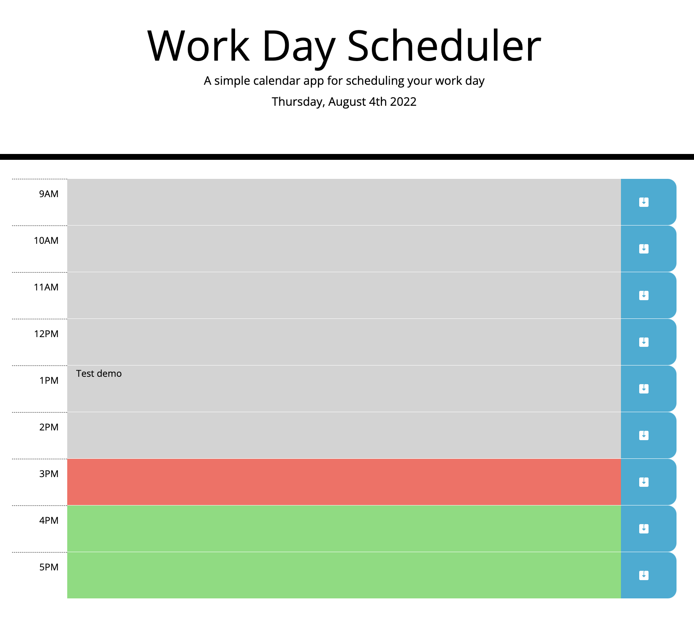

# Work Day Scheduler

## Purpose
This application is meant to track events/task through the working hour (9-5) for each day. The user is able see the current date information at the top of the page and able to input tasks and events at each hour of a normal working day by click on each time slot. Time slots will be colour coded to help user distingush whether a specific time slot is in the past, present, or future. The users is able to store the event by click on the save icon to store the input data into local storage. Please note, each task will only be saved if the corrisponding save botton is clicked. Data stored will be loaded and presented to the page when the user refresh or reopen the page.

## Feature Screenshots
* Time slot colour is reflected based on current time. Grey for the past time, Red for current time , and Green for future time.

* User is able to edit each time block and data is saved once the save icon is selected. Each time you'd like to save a task, the corrisponding save button needs to be clicked in order to save the task into local storage. 

* data is then loaded when page is refreshed or reopened

## Built With
* HTML
* CSS
* JavaScript
* Jquery
* Bootstrap
* Moment Js

## Website
